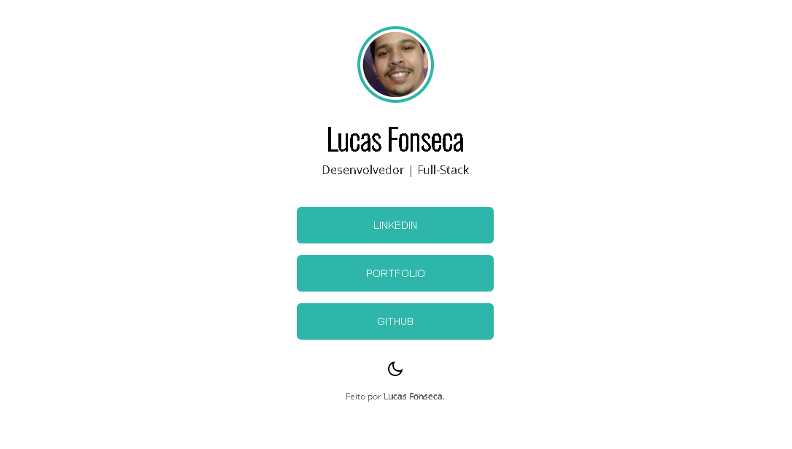

# Página de links - Lucas Fonseca

 

> 🚀 <a href="">Acesse aqui</a>

## 💻 Sobre

Página de links, na propósta de ser usada para biografia no Instagram.

## 🧠 Tecnologias

    
    
    

 

---

<table>
  <tr>
    <td>
      Feito por <a href="https://github.com/luskafonseca">Lucas Fonseca</a> 
    </td>
  </tr>
</table>
